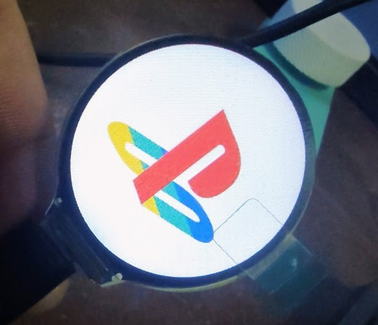
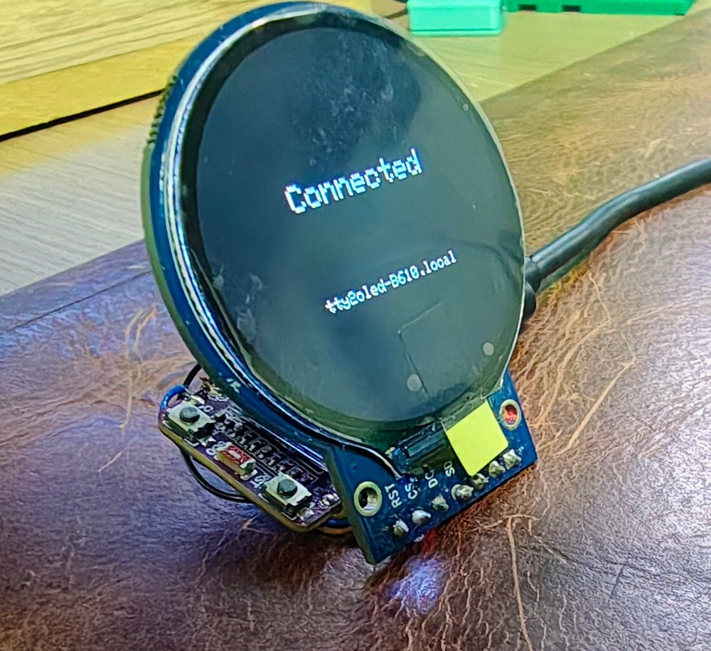
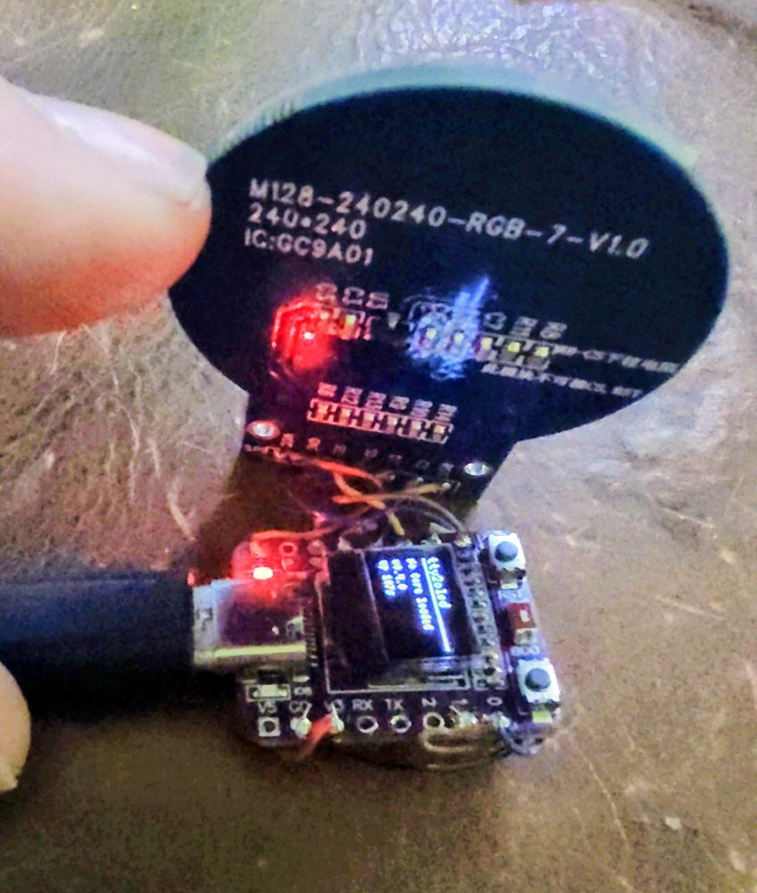
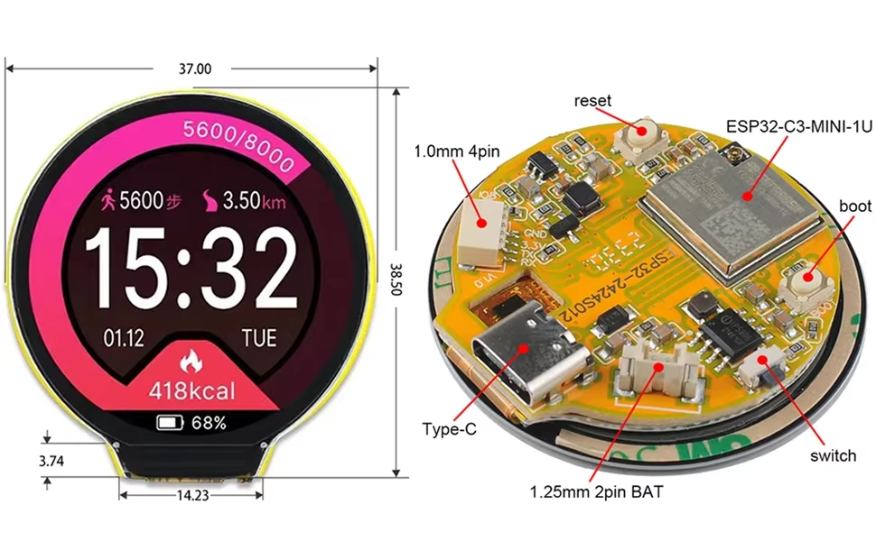

# tty2oled-gc9a01

An ESP32-C3 + GC9A01 (240×240 round SPI display) reimplementation of
[venice1200/MiSTer_tty2oled](https://github.com/venice1200/MiSTer_tty2oled) —
a physical marquee/status display for a [MiSTer FPGA](https://github.com/MiSTer-devel/Main_MiSTer/wiki)
that shows per-core artwork on a small screen.

It's **protocol-compatible** with the original: an unmodified
`tty2oled.sh` daemon on a real MiSTer talks to this firmware exactly as it
would to the original SSD1322-based hardware over USB serial (handshake,
contrast/rotation commands, and the legacy fixed-size grayscale picture
transfer all work unchanged). On top of that, it adds full-color JPEG
marquee art suited to the round display, a standalone web app for
building and previewing that art, WiFi (its own access point + a small
setup portal, no cable required to get it onto your network), the same
command protocol reachable over WiFi via WebSocket, and MQTT
notifications so things like Home Assistant can push text/image alerts
to the display.

## In action

On a real MiSTer, running the unmodified `tty2oled.sh` over USB with the
Sunton ESP32-2424S012C as the display (opening a few autoboot console
cores):

https://github.com/user-attachments/assets/e21d0f48-6ad6-45be-bac6-51889ecf6de4

([download the mp4](docs/mister-demo.mp4), 9 MB)

Full-color art (the extended `CMDCORC` command, sent by hand):

[](docs/color-marquee-full.jpg)

## What's in this repo

- **`firmware/`** — PlatformIO project for the ESP32-C3. Speaks the wire
  protocol below (over USB serial *and* WiFi), decodes JPEGs on-device,
  drives the GC9A01 panel with a small hand-rolled SPI driver (see [Why a
  custom display driver](#why-a-custom-gc9a01-driver)), and optionally
  drives an onboard 0.42" status OLED.
- **`web/`** — a Vite + TypeScript single-page app. Lets you browse a
  library of per-core marquee art, crop/pan/zoom it to fit the round
  display, preview transition effects locally, and push it live to a
  connected device over [WebSerial](https://developer.mozilla.org/en-US/docs/Web/API/Web_Serial_API)
  (Chrome/Edge only) or WiFi (WebSocket).
- **`tools/`** — a small Python conversion pipeline that turns the
  community's legacy `.gsc`/`.xbm` marquee packs into PNGs for the web
  app's library browser.
- **`reference/`** — the upstream `MiSTer_tty2oled` project, included as a
  git submodule. It's the protocol/format reference this firmware was
  built to be compatible with; nothing in it is built or copied into this
  project's own code.

## Hardware

| Component | Detail |
|---|---|
| MCU | ESP32-C3-mini (RISC-V, WiFi, native USB-CDC) |
| Display | GC9A01 240×240 round SPI TFT |
| Status display (optional) | Onboard 0.42" SSD1306 OLED, 72×40 visible |
| Wake button | Onboard "BOOT" pushbutton (GPIO9), repurposed at runtime |

The same ESP32-C3-mini board is sold both with and without the built-in
0.42" OLED — the firmware has a build-time flag for each variant (see
[Build & flash](#build--flash-the-firmware)).

### Pins

Edit `firmware/src/pins.h` to match your wiring — it's the single place
all display pins are defined. Verified working on real hardware:

| Signal | GPIO |
|---|---|
| SCLK | 4 |
| MOSI | 0 |
| CS | 7 |
| DC | 1 |
| RST | 10 |
| BL (backlight, PWM) | 3 |
| OLED SDA | 5 (fixed on boards with the onboard OLED) |
| OLED SCL | 6 (fixed on boards with the onboard OLED) |
| Wake button | 9 |

Avoid the C3's strapping pins (GPIO2, 8, 9 — GPIO9 is deliberately used
anyway for the wake button, safe post-boot) and whatever pins your
specific board's onboard peripherals use if you change these. The native
USB-Serial/JTAG peripheral is fixed to GPIO18/19 in hardware and is used
automatically by `Serial` — this is what both a real MiSTer and the web
app's WebSerial connection talk to; it's never wired manually. GPIO20/21
are left free for an optional hardware debug UART (see `protocol.cpp`'s
`DBG_ENABLED`).

### Discrete build: ESP32-C3 Super Mini + GC9A01 module

The reference setup behind the pin table above: an ESP32-C3 **Super Mini**
(the variant with the built-in 0.42" status OLED) wired by jumpers to a
separate GC9A01 round display module. Build it with the default
`pio run -e esp32c3 --target upload` (or `esp32c3_nooled` if your board has
no OLED).



The round display on its "Connected" screen after joining WiFi (the
network name and IP are blurred out in this photo; the `.local` hostname
is the device's mDNS name).



Close-up of the Super Mini: the onboard 0.42" OLED shows the status
dashboard (firmware version, core name, RX activity), and the back of the
GC9A01 module (marked `M128-240240-RGB-7-V1.0`, `IC:GC9A01`) shows the
jumper wiring from the pin table.

### All-in-one board: Sunton ESP32-2424S012C

Also supported, and the simplest option: the Sunton **ESP32-2424S012C** is
a 1.28" round GC9A01 240×240 IPS display with an ESP32-C3-MINI-1U built
onto the back of it, USB-C, a reset and a BOOT button, and a battery
connector. Nothing to wire. This variant has no capacitive touch (the
firmware doesn't use touch anyway) and no status OLED.



The display pins are fixed by the board, and there's no reset GPIO (the
panel reset is tied to the board's reset, so the driver uses the GC9A01
software reset instead). Verified working on real hardware:

| Signal | GPIO |
|---|---|
| SCLK | 6 |
| MOSI | 7 |
| CS | 10 |
| DC | 2 |
| RST | none (software reset) |
| BL (backlight, PWM) | 3 |
| Wake button | 9 (the BOOT button) |

Build it with `pio run -e esp32c3_2424s012 --target upload`. The pins are
selected by the `BOARD_2424S012` flag in `firmware/src/pins.h`.

Verified on real hardware with this board:

- Display init and the `CMDTEST` ring pattern render correctly.
- `CMDHWINF` replies `HWGC9A01C;<version>;`.
- Backlight PWM works: `CMDCON` at 128/64/16/0 visibly dims the screen
  and `CMDCON,255` restores it.
- A full-color `CMDCORC` JPEG transfer (4917 bytes, iris effect) over USB
  decodes and displays correctly, and the firmware acks it.

Not yet tested on this board: sending art through the web app's WebSerial
path (the `CMDCORC` check above used a script speaking the same protocol),
and the WiFi/MQTT features.

## Build & flash the firmware

```bash
cd firmware
pio run -e esp32c3 --target upload          # default: includes the onboard OLED
pio run -e esp32c3_nooled --target upload   # board variant without the OLED
pio run -e esp32c3_2424s012 --target upload # Sunton ESP32-2424S012C all-in-one board
pio device monitor          # 115200 baud, watch for "ttyrdy;"
```

Requires [PlatformIO](https://platformio.org/) (CLI or the VS Code
extension). All dependencies (`JPEGDEC`, `Adafruit GFX Library`,
`ricmoo/QRCode`, `links2004/WebSockets`, `knolleary/PubSubClient`, plus
`U8g2` in the OLED variant) are pulled automatically via `platformio.ini`.

## First boot: WiFi setup

With no WiFi configured, the device starts its own open access point,
`tty2oled-XXXX` (last two bytes of its MAC address). Connect to it with
a phone or laptop — a captive-portal setup page should open
automatically, or browse to `http://192.168.4.1/`. It can scan for
nearby networks or you can type the SSID/password in by hand.

While in AP mode, pressing the wake button shows a scannable WiFi-join
QR code on the round display (encoding the open network's SSID) instead
of its normal screensaver-wake behavior.

Once configured, the device joins your network and is reachable at
`tty2oled-XXXX.local` (mDNS) — the round display's "Connected" screen
shows this hostname, along with the current IP. Visiting that address in
a browser shows a small status page with a "Forget WiFi" button (which
restarts the device back into AP mode) and, once configured, MQTT broker
settings (see [MQTT notifications](#mqtt-notifications) below).

## Run the web app

```bash
cd web
npm install
npm run dev                 # open in Chrome or Edge
```

Pick a display profile (round GC9A01, or a rectangular preview profile —
see [Display profiles](#display-profiles)), select a core, drop in an
image, pan/zoom to fit, and either let the live preview stream to a
connected device automatically or click "Send to device". "Save to
library" persists the art locally in the browser (IndexedDB) so it's
there next time.

The header's transport selector switches between **USB (WebSerial)** and
**WiFi** — for WiFi, enter the device's hostname (`tty2oled-XXXX.local`)
or IP address, then Connect. Both transports speak the identical command
protocol; the app doesn't care which one is active. The header also has
a **Command console** (documents and lets you exercise every command the
firmware understands) and an **About** panel with links back to this
project and the ones it's built on.

### Building the local marquee library

The editor's "Browse local packs" button needs a converted image index,
built from the community packs bundled in `reference/Pictures/ZIPs`
(pulled in via the `reference/` submodule):

```bash
git submodule update --init reference
tools/build_library.sh
# -> library/converted/<pack>/<name>.png + index.json
# -> synced into web/public/library/ for the web app to fetch
```

This step is optional and its output isn't tracked in this repo (see
[License](#license) — the bundled packs are third-party fan-made assets
of unclear licensing, kept local-only rather than redistributed). Cores
whose id matches a pack filename (or a known alias in
`web/src/aliases.ts`) auto-fill in the library grid once this is run.

## Wire protocol

115200 baud, line-based ASCII commands terminated by `\n`. The firmware
sends `ttyrdy;` once after boot, then `ttyack;` (no trailing newline)
after each processed command, unless `CMDSTTYACK,0` disables it — the
same handshake the original `tty2oled.sh` daemon expects.

**Commands compatible with the original protocol** (same behavior as
upstream, so an unmodified MiSTer daemon works unchanged):
`CMDCLS`/`cls`, `CMDCLSWU`, `CMDSORG`/`sorg`, `CMDCON,<0-255>`,
`CMDROT,<0|1>`, `CMDTXT,x,y,size,text`, `CMDGEO,type,x,y,w,h,fill`,
`CMDSNAM`, `CMDDOFF`, `CMDDON`, `CMDDUPD`, `CMDSECD,<ms>`, `CMDSHCD`,
`CMDSTTYACK,<0|1>`, `CMDRESET`, `CMDSAVER,<mode>,<interval>,<logotime>`
(parses the original's full grammar; implements simple blank-after-idle,
not its animated multi-screen screensaver), `CMDSWSAVER,<0|1>`, and a
bare line with no `CMD` prefix (legacy plain-corename fallback).

**Also implemented, new but original-protocol-shaped**: `CMDBYE`,
`CMDTEST`, `CMDSHSYSHW` (cosmetic/diagnostic screens built from
primitives, not the original's bitmap assets), `CMDHWINF` (replies
`HWGC9A01C;<version>;`), `CMDCLST,<transition>,<color>` (solid-color
fill), `CMDSPIC[,<effect>]` (redisplay the last picture with a new
transition), `CMDSSCP` (redisplay at reduced size), `CMDSETTIME,<epoch>`
(sets the device clock; `tty2oled.sh` sends it at startup) and `CMDSHTIME`
(shows the clock as HH:MM plus date; not persisted across reboots).

**Legacy picture transfer**: `CMDCOR,<name>,<effect>` or `CMDAPD,...`
followed by a blocking, fixed-size read of exactly 2048 (1bpp XBM) or
8192 (4bpp grayscale "GSC") raw bytes, classified purely by byte count —
identical to upstream. Source images are 256×64; on the round display
they're scaled to fit (not cropped), since the safe display area is the
same 4:1 aspect ratio as the source.

**Full-color art**: `CMDCORC,<name>,<effect>,<durationMs>,<length>\n`
followed by exactly `<length>` raw JPEG bytes, length-prefixed (not
size-classified, so it isn't subject to the legacy path's fixed-size
truncation behavior). Decoded on-device and revealed with a transition
effect over `durationMs`. Effect ids (shared between firmware and web
app):

| id | effect |
|---|---|
| 0 | none (instant cut) |
| 1 | wipe left → right |
| 2 | wipe right → left |
| 3 | wipe top → bottom |
| 4 | iris (expand from center) |
| 5 | fade (cross-dissolve) |

### Over WiFi

The same command grammar is also reachable over a WebSocket on port 81
once the device has joined your network (see [First boot: WiFi
setup](#first-boot-wifi-setup)) — `ws://tty2oled-XXXX.local:81/`,
advertised via mDNS as `_ws._tcp`. `CMDCORC`'s JPEG payload is sent as a
text header frame followed by the image chunked into small binary
frames, rather than one big length-prefixed blob — this keeps every
allocation the device's WebSocket library needs to make small and
constant regardless of image size. Legacy `CMDCOR`/`CMDAPD` (raw
XBM/GSC) aren't supported over this transport — that grammar exists for
real-MiSTer-over-serial compatibility, and a WiFi client always has the
modern JPEG path available instead.

## MQTT notifications

Point the device at an MQTT broker (Home Assistant's built-in Mosquitto
add-on, or any other local broker) via the web status page's MQTT
section, and it'll show:

- A temporary text banner on any message published to `<prefix>/text`.
- A fetched image on any message published to `<prefix>/image` (the
  payload is a URL to a JPEG, not the image bytes themselves).

`<prefix>` defaults to `tty2oled/<device name>` and is configurable.
Both notification types show for a configurable duration (default 8s),
wake the display if the screensaver had blanked it, and then revert to
whatever marquee art was showing before them. Plain MQTT only (port
1883, no TLS) — suited to a local-network broker, not a cloud one.

## Display profiles

The web app's editor targets a selectable display profile
(`web/src/displays.ts`): the round GC9A01 this firmware drives, the
legacy 256×64 SSD1322 (real original hardware), and a couple of generic
rectangular sizes kept as preview/export targets for a possible future
firmware variant. Only the profiles with matching real firmware get a
live "Send to device" — GC9A01 sends `CMDCORC` JPEGs, the legacy SSD1322
profile sends `CMDCOR` grayscale GSC data; the generic rect profiles are
preview-only since no real hardware exists for them.

## Compatibility notes

This firmware was checked against the actual `tty2oled.sh` daemon script
(not just its documentation) to confirm real-world compatibility:

- The daemon never reads anything back from the device in its main
  loop — it just writes commands with fixed sleeps between them, so this
  firmware's `ttyack;` replies are harmlessly ignored, not required.
- **Device path matters.** This firmware uses the ESP32-C3's native
  USB-CDC peripheral, which Linux enumerates as `/dev/ttyACM*` — the
  original hardware used a CP2102/FTDI-style chip, enumerating as
  `/dev/ttyUSB*`. Point `TTYDEV` at the right one in
  `tty2oled-system.ini`, and make sure `USBMODE="yes"` (otherwise the
  daemon only ever sends plain core names, no picture data).
- `CMDSETTIME`, sent once at daemon startup, isn't implemented — it
  falls through to the bare-line fallback and briefly flashes as garbled
  "core name" text before the first real core name overwrites it.
  Cosmetic only. (`CMDSAVER` *is* implemented, see [Wire
  protocol](#wire-protocol) above — this note used to say otherwise.)

## Why a custom GC9A01 driver

Two existing Arduino display libraries were tried first and both had real
ESP32-C3 bugs, only discovered by flashing actual hardware:

1. **`moononournation/GFX Library for Arduino`** — its fast SPI databus
   references a hardware register (`DR_REG_SPI3_BASE`) that doesn't exist
   on the C3, pulled in unconditionally regardless of which databus class
   is actually used. Compile-time failure, never got as far as flashing.
2. **`TFT_eSPI`** — compiled and flashed cleanly, but hung the chip on
   every boot inside its ESP32-C3-specific SPI init path (task watchdog
   reset, confirmed via bisection with checkpoint logging, with the
   underlying SPI wiring separately proven fine via a bare `SPIClass`
   diagnostic sketch).

Given both, `firmware/src/gc9a01.h`/`.cpp` is a ~150-line direct driver
on top of plain Arduino `SPIClass` — manual CS/DC/RST toggling, the
GC9A01's standard vendor register-init sequence (adapted from
TFT_eSPI's MIT-licensed `GC9A01_Init.h` — reused as functional
hardware-bring-up data, not as library code), and a fast `pushRect()`
bulk blit for JPEG frames and transitions. It subclasses `Adafruit_GFX`
only for its software text/shape routines.

## Future implementations

Nothing here is built yet; these are directions, not commitments.

### Untethering the display from the MiSTer

Today a real MiSTer drives the display over a USB cable, because that's
the only transport `tty2oled.sh` speaks. The firmware already has the
other half of a wireless setup: once it has joined your WiFi it serves
the same command grammar over a WebSocket (see [Over WiFi](#over-wifi)),
and the web app already uses it. What's missing is a MiSTer-side client
so the cable can go away and the display can sit anywhere in range.

Rough shape of what that would take:

- **A small bridge on the MiSTer** that watches the same core-name file
  `tty2oled.sh` does, opens a WebSocket to the display, and forwards the
  startup commands (contrast, rotation, time, screensaver) and each core
  change. The stock script only writes to a serial device, so this would
  be a separate script or a transport option, not a change to the
  upstream project.
- **Legacy pictures over the socket.** Legacy `CMDCOR`/`CMDAPD` (raw
  XBM/GSC) are deliberately not accepted over WebSocket today. For an
  unmodified marquee library to work wirelessly, either the firmware
  gains a chunked legacy-picture path, or the bridge converts those
  pictures to the JPEG path before sending.
- **Finding the display.** The device advertises `_ws._tcp` over mDNS,
  but a MiSTer may not have a resolver for it, so the bridge would most
  likely read a host or IP from its config file at first.
- **Reconnects.** WiFi drops are normal, unlike a cable: the bridge would
  need to reconnect and replay the current core so the display isn't left
  stale after a router reboot.
- **Mixed setups.** USB stays the default and keeps working unchanged;
  wireless would be opt-in.

## License

The code in this repository (`firmware/`, `web/`, `tools/`) is licensed
under the [MIT License](LICENSE).

A few things are explicitly **not** covered by that grant:

- **`reference/`** is a git submodule pointing at the upstream
  [`MiSTer_tty2oled`](https://github.com/venice1200/MiSTer_tty2oled)
  project, which is GPLv3-licensed. It's included purely as a
  protocol/format reference — this firmware is an independent, from-
  scratch reimplementation of the same wire protocol, not a derivative of
  that codebase. Interoperating with a GPL project's protocol doesn't
  require this project to be GPL, but the submodule's own contents
  remain under its original license.
- The community marquee art packs referenced by `tools/build_library.sh`
  (fetched from `reference/Pictures/ZIPs` via the submodule above) are
  third-party fan-made assets of unclear/unverified licensing. They are
  **not** included in this repository — `library/converted/` and
  `web/public/library/` are build output, gitignored, and only ever
  generated locally on your own machine if you choose to run that
  script.

## Acknowledgments

Built on the protocol and hardware design work of
[venice1200 and ojaksch](https://github.com/venice1200/MiSTer_tty2oled),
the original tty2oled project's authors. The onboard status OLED support
was ported from a [WLED usermod](https://github.com/wled/WLED/pull/5475)
for the same panel.
